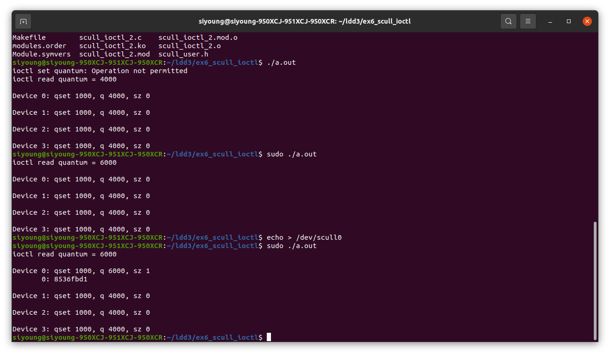

``` bash
make
```

``` bash
sudo insmod scull_ioctl.ko
```

``` bash
sudo mknod /dev/{device_name} c {major} {minor(default:0)}
sudo chmod 666 /dev/{device_name}
```

여기까지는 기존 scull과 마찬가지로 커널 모듈을 빌드하고 모듈 로드 및 디바이스 노드를 추가하는 과정이다.

<br>

<h2> 사용자 코드 </h2>

`/dev/scull0` 즉 0번 디바이스만 열어 장치의 `quantum`을 `6000`으로 수정하고 디바이스에 접근해 수정된 `quantum` 값을 받아오는 코드이다.

이후에는 `cat /proc/scullmem`명령어를 진행하며 다음과 같은 동작이 이루어진다.

1. `/proc/scullmem` open
2. 모듈 내 `scull_proc_open` 호출
3. `seq_open` 호출
4. `cat`명령에 의해 `seq_operations` 순회하며 호출
5. 따라서 각 디바이스의 정보 출력

> 해당 사용자 코드는 Ubuntu 20.04 LTS 로컬 환경에서 동작하며 타겟 보드나 아키텍쳐가 없기에 `gcc`명령을 통해 실행 파일을 생성하면 된다.

<br>

<h2> 결과 </h2>



처음 사용자 코드 실행 시 반환 값은 `6000`으로 정상적으로 출력되지만 `/dev/scullmem`을 확인했을 때 모든 `quantum`이 `4000`으로 변화가 없음을 확인할 수 있다.

따라서 `echo`를 통해 `O_WRONLY` 플래그로 `open`하여 `scull_trim`을 유도하여 `dev->quantum`이 다시 내부 변수인 `quantum`으로 변경되도록 하였다. 즉 현재 사용자 코드를 통해 `ioctl`을 호출하여 `quantum`전역 변수만 수정되는데 실제 장치에 해당 변수를 반영하는 과정이 필요하기에 `scull_trim`으로 실제 반영을 유도하는 것이다.