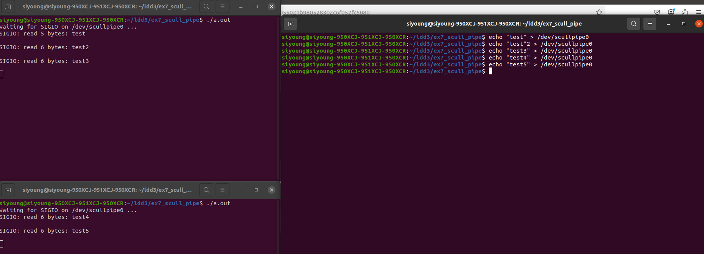
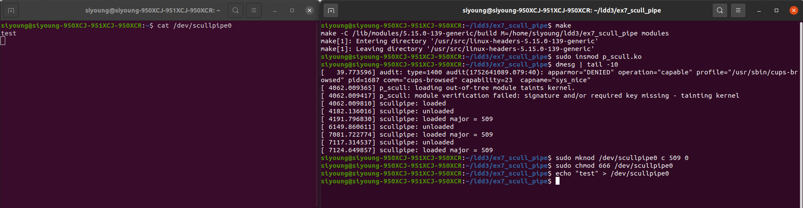

``` bash
make
```

``` bash
sudo insmod scull_pipe.ko
```

``` bash
sudo mknod /dev/{device_name} c {major} {minor(default:0)}
sudo chmod 666 /dev/{device_name}
```

여기까지는 기존 scull과 마찬가지로 커널 모듈을 빌드하고 모듈 로드 및 디바이스 노드를 추가하는 과정이다.

<br>

<h2> 사용자 코드 </h2>

1. `fcntl`함수를 통해 드라이버 모듈의 `fasync`호출
2. `pid`를 `struct scull_pipe`의 `struct fasync_struct`에 등록
3. `SIGIO`의 핸들러인 `sigio_handler`등록
4. `while`반복문을 통해 `SIGIO`신호를 기다리며 도착한 경우 `read`를 통해 `scull_pipe`버퍼의 데이터를 읽어옴

여러 프로세스로 사용자 프로그램을 실행하더라도 정상적인 동작은 가능하지만 어떤 프로세스로 `SIGIO`를 전송할 지는 지정할 수 없다.
따라서 여러 프로세스 중 임의의 한 프로세스가 데이터 버퍼를 읽어온다.

> 해당 사용자 코드는 Ubuntu 20.04 LTS 로컬 환경에서 동작하며 타겟 보드나 아키텍쳐가 없기에 `gcc`명령을 통해 실행 파일을 생성하면 된다.

<br>

<h2> 결과 </h2>



두 개의 프로세스를 생성하는 경우 어떤 프로세스로 `SIGIO`신호를 줄 지는 지정할 수 없지만 race condition은 발생하지 않는다.

이는 `scull_pipe`장치에서 데이터를 읽어올 때 세마포어로 lock 처리를 하기 때문이며, 임의의 순서를 제외하면 정상적으로 동작함을 확인할 수 있다.

만약 사용자 프로그램이 아닌 `cat` & `echo` 방식으로 확인하고 싶은 경우에는 `cat`명령어 특성에 따라 `EOF`를 전달받기 전까지는 데이터 입력을 대기하고 있음을 유의하자. `cat` & `echo` 방식의 실행 결과는 다음과 같다.

